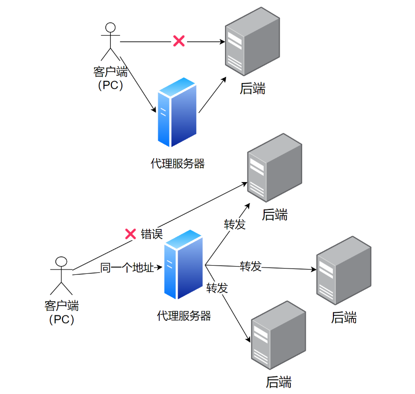

# user-center

- 介绍

  user-center：这是用户中心项目，可以成为未来许多项目的基础


- 定位

  经验和方法的感知

  写代码自己解决、除了写逻辑其他不需要自己动手
  
  先做设计、代码实现、持续优化


- 完整项目开发流程、企业级开发技术

  1. 用户中心：学完框架新手入门、完整项目开发流程

  2. 伙伴匹配系统：Redis、事务、并非编程、大数据推荐思想

  3. API开放平台：架构设计、sdk开发、API签名认证、RPC、微服务网关

  4. 聚合搜索平台：爬虫、ElasticStack、设计模式

  5. 智能BI项目：异步化、线程池、RabbitMQ、AIGC

  6. OJ在线判题系统：

  7. 定制化代码生成项目：
  8. RPC框架：

- 企业项目流程

  需求分析 -> 概要设计详细设计 -> 技术选型

  初始化/引入需要的技术 -> 写demo -> 写代码实现业务逻辑 -> 单元测试 -> 代码提交代码评审 -> 部署发布

  


# 【项目】用户中心

- 参考

  [好东西](https://www.dsjtm.com/)、[用户中心Golang版](https://articles.zsxq.com/id_tmiv1m92rndu.html)、[课程细致笔记](https://www.aliyundrive.com/s/czdYe2ZZXux)


- 需求分析

  市场应用：微信、支付宝账号登录多个平台

  用户体系：登录注册、用户管理(仅管理员可见)、用户校验(仅星球用户)

  - 登录注册：对用户的增加查询
  - 用户管理：对用户的查询修改
  - 用户校验：合法性 (爬虫、excel处理、定时任务)

  

- 技术选型

  前端：三件套 + `React` + 组件库`AntDesign` + `Umi` + 现成管理系统`AntDesignPro`

  后端：`java` + `spring` + `springmvc` + `mybatis-plus` + `springboot` + 数据库`mysql`

  - `spring`：依赖注入框架、帮你管理java对象、集成一些内容
  - `springmvc`：web框架、提供接口访问、restful接口等能力
  - [`mybatis-plus`](https://baomidou.com/)：操作数据库、持久层框架、再封装即不用写sql
  - `springboot`：不用自己管理spring配置、不用自己整合各种框架、快速启动快速集成项目

  部署：服务器、容器(平台)

- ant design家族

  ant design 组件库 (封装了react)

  [ant design procomponents](https://procomponents.ant.design/components/form)  面向业务 定制化 (封装了ant design)

  ant design pro 后台管理系统 (由ant design、react、ant design procomponents及其他库组成)


- 计划

  初始化项目：

  - 前端初始化：初始化、引入一些组件、框架介绍、项目瘦身

  - 后端初始化：准备环境(mysql)、引入框架整合框架

  登陆注册：前端、后端

  - 后端：注册和登录、service controller和接口测试
  - 前端：个性化、删代码；对接后端接口、获取用户的登录态
  - 注销功能
  
  用户管理：前端、后端
  
  - 后端：用户管理接口 (用户查询 状态更改)
  - 前端：开发；前端代码瘦身
  
  校验用户：星球用户
  
  


## 前端初始化

- 前置环境

  nodejs稳定版、[Ant Design Pro](https://pro.ant.design/zh-CN/docs/getting-started)、[umi文档](https://umijs.org/docs/guides/getting-started)

- 一些问题

  [Ant Design Pro的gitee仓库](https://gitee.com/ant-design/ant-design-pro/)

  [鱼皮的用户中心项目 前端Ant Design Pro构建](https://www.yuque.com/shayushitiande/hcq960/wigdtf?)

  [我遇到了项目启动失败的问题解决方案](https://www.cnblogs.com/codewhimsy/articles/17641636.html#:~:text=%23 ant design pro 项目启动失败 环境： node v18.17.1,npm install yarn tyarn -g npm i %40ant-design%2Fpro-c)

  [炎的笔记](https://wx.zsxq.com/dweb2/index/topic_detail/184522182814122)


- 初始化项目 (查官网)

  ```
  # 只是拉取脚手架代码
  yarn global add @ant-design/pro-cli
  pro create web-ts --typescript
  # 依赖安装的目录  
  cd web-ts && yarn install
  # 安装umi ui
  yarn add @umijs/preset-ui -D
  # 启动项目
  yarn start
  
  
  # 只是拉取脚手架代码
  npm i @ant-design/pro-cli -g
  pro create web-ts
  # 依赖安装的目录  
  cd web-ts && npm install
  # 安装umi ui
  npm install @umijs/preset-ui --save-dev
  # 启动项目
  npm run start
  ```

  一些前置问题

  ```
  npm install --global yarn
  
  yarn config set registry https://registry.npm.taobao.org -g
  yarn config set sass_binary_site http://cdn.npm.taobao.org/dist/node-sass-g
  
  yarn config set global-folder "D:\systemEnvironment\nodejs\yarn\global"
  yarn config set cache-folder "D:\systemEnvironment\nodejs\yarn\cache"
  
  
  yarn config get registry
  yarn config set registry https://registry.yarnpkg.com
  ```

- 瘦身项目

  删除国际化：执行 `i18n-remove` 脚本、删除项目路径下 src/locales 文件夹 

  删除项目路径下 src/e2e 文件夹：e2e 文件夹里面定义的是一系列测试流程 

  若前面有使用 umi ui 添加页面，可把该页面删除 (注意：需要在路径为 config/routes.ts 的文件夹下，删除对应的路由规则 )

  删除项目路径下 src/services/swagger 文件夹：swagger 文件夹里面定义了一系列后台接口程序 

  删除项目路径下 config/oneapi.json 文件：oneapi.json 定义了整个项目用到的一些接口 

  删除项目根路径下 tests 文件夹：tests 文件夹主要是和测试相关的 

  删除项目根路径下 jest.config.js 文件：jest.config.js 测试相关的配置文件 

  删除项目根路径下 playwright.config.ts 文件：playwright.config.ts -> 自动化测试工具，帮你在火狐或谷歌自动测试，不用真实地打开浏览器就能测试

  ```
  cd 
  rm -rf src/locales 
  rm -rf src/e2e
  rm -rf src/services/swagger/  # 
  rm -rf config/oneapi.json  # 
  rm -rf tests 
  rm -rf jest.config.js
  rm -rf playwright.config.ts 
  ```
  
  


## 后端初始化

- 集成开发工具：IDEA、webStorm (不需要其他)

- 三种方式

  github上搜索springboot模板 , 拉现成的模板 (不推荐)

  [SpringBoot 官方模板生成器](https://start.spring.io/)

  集成开发工具IDEA (推荐)

- spring官方不再支持java8 https://start.spring.io

  用阿里云提供的脚手架 https://start.aliyun.com/ 

  

- 框架整合

  [mybatisplus官方文档](https://baomidou.com/pages/226c21/)

  ```
  mysql -uroot -p123456
  create database user_center;
  use user_center;
  
  ```

  


## 数据库表设计

- 数据库 - 表(模型) - 字段

  用户表：

  id(主键)、userAccount、username、avatarUrl、gender、userPassword、phone、email、userStatus；

  createTime、updateTime、isDelete；

  数据库字段添加索引……

  表与表之间的关联……

  ```sql
  drop table if exists user;
  create table user
  (
      id           bigint auto_increment primary key comment '唯一ID',
      username     varchar(255) comment '用户名',
      userAccount  varchar(255) comment '登录账号',
      avatarUrl    varchar(1024) comment '用户头像URL',
      gender       tinyint comment '用户性别',
      userPassword varchar(512) not null comment '用户密码',
      phone        varchar(128) comment '用户电话号码',
      email        varchar(512) comment '用户电子邮件',
      userStatus   int       default 0 comment '用户状态0为正常',
      createTime   timestamp default current_timestamp comment '创建时间',
      updateTime   timestamp default current_timestamp on update current_timestamp comment '更新时间',
      isDelete     tinyint   default 0 comment '逻辑删除标志',
      userRole int default 0 comment '用户角色 0是普通用户 1是管理员'
  );
  
  insert into user (username, useraccount, avatarurl, gender, userpassword, phone, email, userstatus,
                    createtime, updatetime, isdelete)
  values ('AliceSmith', 'alice.smith', 'https://avatars.com/alice.jpg', 1, 'alicepass123', '+15551234567',
          'alice.smith@gmail.com', 0, current_timestamp, current_timestamp, 0),
         ('BobJohnson', 'bob.johnson', 'https://avatars.com/bob.jpg', 0, 'bobpass456', '+15551234568',
          'bob.johnson@yahoo.com', 0, current_timestamp, current_timestamp, 0),
         ('CharlieBrown', 'charlie.brown', 'https://avatars.com/charlie.jpg', 1, 'charliepass789', '+15551234569',
          'charlie.brown@outlook.com', 0, current_timestamp, current_timestamp, 0),
         ('DianaPrince', 'diana.prince', 'https://avatars.com/diana.jpg', 2, 'dianapass123', '+15551234570',
          'diana.prince@hotmail.com', 0, current_timestamp, current_timestamp, 0),
         ('EinsteinM', 'einstein.m', 'https://avatars.com/einstein.jpg', 1, 'einsteinpass456', '+15551234571',
          'einstein.m@icloud.com', 0, current_timestamp, current_timestamp, 0);
  ```
  
- [逻辑删除](https://baomidou.com/pages/6b03c5/#%E4%BD%BF%E7%94%A8%E6%96%B9%E6%B3%95)

  D:\code2\java-code\user-center\user-center-java\src\main\resources\application.yml

  ```yml
  spring:
    application:
      name: user-center-java
    datasource:
      driver-class-name: com.mysql.jdbc.Driver
      url: jdbc:mysql://localhost:3306/user_center
      username: root
      password: 123456
    session:
      timeout: 86400 # 1天的session过期时间
  server:
    port: 8080
    servlet:
      context-path: /api  # 指定接口全局api前缀
  
  mybatis-plus:
    configuration:
      map-underscore-to-camel-case: false
    global-config:
      db-config:
        logic-delete-field: isDelete # 全局逻辑删除的实体字段名(since 3.3.0,配置后可以忽略不配置步骤2)
        logic-delete-value: 1 # 逻辑已删除值(默认为 1)
        logic-not-delete-value: 0 # 逻辑未删除值(默认为 0)
  
  ```
  
  


## 登陆注册的后端开发

- 规整项目目录

  `controller ` 接收请求(封装接口给前端调用)、`service` 业务逻辑、`mapper` 数据库操作

  `model` 数据库模型、`utils`工具类、配置信息、全局变量常量

  ```
  mkdir src/main/java/com/time1043/usercenterjava/controller
  mkdir src/main/java/com/time1043/usercenterjava/service
  mkdir src/main/java/com/time1043/usercenterjava/utils
  
  ```

  

- 实现基本的数据库操作

  模型 `User` 对象，和数据库的字段关联 (插件 `mybatisx` `generateAllSetter`)

  D:\code2\java-code\user-center\user-center-java\src\test\java\com\time1043\usercenterjava\service\UserServiceTest.java

  ```java
  package com.time1043.usercenterjava.service;
  
  import com.time1043.usercenterjava.model.domain.User;
  import org.junit.jupiter.api.Assertions;
  import org.junit.jupiter.api.Test;
  import org.springframework.boot.test.context.SpringBootTest;
  
  import javax.annotation.Resource;
  
  
  /*
   * 用户服务测试
   *
   * @author yingzhu
   */
  @SpringBootTest
  class UserServiceTest {
  
      @Resource
      private UserService userService;
  
      @Test
      public void testAddUser() {
          User user = new User();
          user.setUsername("yz");
          user.setUserAccount("123");
          user.setAvatarUrl("https://encrypted-tbn0.gstatic.com/images?q=tbn:ANd9GcT4x04v80EHkp_6zoMIc_hG0L8_QvDlvjC-fw&usqp=CAU");
          user.setGender(0);
          user.setUserPassword("xxx");
          user.setPhone("123");
          user.setEmail("456");
  
          boolean result = userService.save(user);
          System.out.println(user.getId());
          Assertions.assertTrue(result);
      }
  }
  ```

  


- 注册逻辑

  用户在前端输入账号和密码、以及校验码

  校验用户的账户、密码、检验密码是否符合要求

  - 非空检验、账户不小于4位、密码不小于8位、账户不能重复、账户不含特殊字符、密码和校验密码相同

  对密码进行加密 (千万不要明文存储数据库)

  向数据库插入用户数据

  

- 单机登录 (后续改造 redis分布式 第三方登录)

  登录接口

  接收参数：用户账户、密码

  请求类型：POST

  请求体：JSON

  返回值：用户信息 (脱敏)

- 登录逻辑

  检验用户账户和密码是否合法 (非空、账户不小于4、密码不小于8、账户不含特殊字符)

  校验密码是否输入正确，要和数据库密码密文对比

  记录用户的登录态 (session)，存到服务器上 (后端springBoot封装的服务器 tomcat)

  返回用户信息 (脱敏)

- Q：如何知道是哪个用户登录？session、cookie

  


- 代码实现：注册、登录 (service层)

  D:\code2\java-code\user-center\user-center-java\src\main\java\com\time1043\usercenterjava\service\UserService.java  [apache-commons 校验](https://mvnrepository.com/artifact/org.apache.commons/commons-lang3)

  ```java
  package com.time1043.usercenterjava.service;
  
  import com.time1043.usercenterjava.model.domain.User;
  import com.baomidou.mybatisplus.extension.service.IService;
  
  import javax.servlet.http.HttpServletRequest;
  
  /**
   * @author yingzhu
   * @description 针对表【user】的数据库操作Service
   * @createDate 2024-03-21 09:37:23
   */
  public interface UserService extends IService<User> {
      /**
       * 用户注册
       *
       * @param userAccount   用户账户
       * @param userPassword  用户密码
       * @param checkPassword 校验密码
       * @return 注册成功返回用户ID，失败返回0
       */
      long userRegister(String userAccount, String userPassword, String checkPassword);
  
      /**
       * 用户登录
       *
       * @param userAccount  用户账户
       * @param userPassword 用户密码
       * @param request
       * @return 返回脱敏后的用户信息
       */
      User userLogin(String userAccount, String userPassword, HttpServletRequest request);
  }
  
  ```

  D:\code2\java-code\user-center\user-center-java\src\main\java\com\time1043\usercenterjava\service\impl\UserServiceImpl.java

  ```java
  package com.time1043.usercenterjava.service.impl;
  
  import com.baomidou.mybatisplus.core.conditions.query.QueryWrapper;
  import com.baomidou.mybatisplus.extension.service.impl.ServiceImpl;
  import com.time1043.usercenterjava.mapper.UserMapper;
  import com.time1043.usercenterjava.model.domain.User;
  import com.time1043.usercenterjava.service.UserService;
  import lombok.extern.slf4j.Slf4j;
  import org.apache.commons.lang3.StringUtils;
  import org.springframework.stereotype.Service;
  import org.springframework.util.DigestUtils;
  
  import javax.annotation.Resource;
  import javax.servlet.http.HttpServletRequest;
  import java.util.regex.Matcher;
  import java.util.regex.Pattern;
  
  import static com.time1043.usercenterjava.contant.UserConstant.USER_LOGIN_STATE;
  
  /**
   * @author yingzhu
   * @description 针对表【user】的数据库操作Service实现
   * @createDate 2024-03-21 09:37:23
   */
  @Service
  @Slf4j
  public class UserServiceImpl extends ServiceImpl<UserMapper, User>
          implements UserService {
  
      @Resource
      private UserMapper userMapper;
  
      /**
       * 密码加密盐
       */
      private static final String SALT = "eleven";
  
      @Override
      public long userRegister(String userAccount, String userPassword, String checkPassword) {
          // 校验
          if (StringUtils.isAnyBlank(userAccount, userPassword, checkPassword)) {
              return -1;  // todo 后续封装为自定义异常
          }
          if (userAccount.length() < 4) {
              return -1;
          }
          if (userPassword.length() < 8 || checkPassword.length() < 8) {
              return -1;
          }
          // 账户不能包含特殊字符 正则表达式
          String validPattern = "^[a-zA-Z0-9]+$";
          Matcher matcher = Pattern.compile(validPattern).matcher(userAccount);
          if (!matcher.find()) {
              return -1;
          }
          // 密码和检验密码一致
          if (!userPassword.equals(checkPassword)) {
              return -1;
          }
          // 账户不能重复 先数据库查询 查询数据库有性能的消耗要放在后面
          QueryWrapper<User> queryWrapper = new QueryWrapper<>();
          queryWrapper.eq("userAccount", userAccount);
          long count = userMapper.selectCount(queryWrapper);
          if (count > 0) {
              return -1;
          }
  
          // 对密码进行加密处理
          String encryptPassword = DigestUtils.md5DigestAsHex((userPassword + SALT).getBytes());
  
          // 插入数据到数据库
          User user = new User();
          user.setUserAccount(userAccount);
          user.setUserPassword(encryptPassword);
          boolean saveResult = this.save(user);
          if (!saveResult) {
              return -1;
          }
  
          return user.getId();
      }
  
      @Override
      public User userLogin(String userAccount, String userPassword, HttpServletRequest request) {
          // 校验
          if (StringUtils.isAnyBlank(userAccount, userPassword)) {
              return null;
          }
          if (userAccount.length() < 4) {
              return null;
          }
          if (userPassword.length() < 8) {
              return null;
          }
          // 账户不能包含特殊字符 正则表达式
          String validPattern = "^[a-zA-Z0-9]+$";
          Matcher matcher = Pattern.compile(validPattern).matcher(userAccount);
          if (!matcher.find()) {
              return null;
          }
          // 对密码进行加密处理
          String encryptPassword = DigestUtils.md5DigestAsHex((userPassword + SALT).getBytes());
          // 查询数据库
          QueryWrapper<User> queryWrapper = new QueryWrapper<>();
          queryWrapper.eq("userAccount", userAccount);
          queryWrapper.eq("userPassword", encryptPassword);
          User user = userMapper.selectOne(queryWrapper);
          // 密码错误 or 用户不存在
          if (user == null) {
              log.info("user login failed, userAccount: {}, userPassword: {}", userAccount, userPassword);
              return null;
          }
  
          // 脱敏处理
          User safetyUser = getSafetyUser(user);
  
          // 记录用户的登录态 session cookie
          request.getSession().setAttribute(USER_LOGIN_STATE, safetyUser);
  
          // 限流策略...
          return safetyUser;
      }
  
      /**
       * 用户信息脱敏处理
       *
       * @param originalUser
       * @return
       */
      @Override
      public User getSafetyUser(User originalUser) {
          User safetyUser = new User();
          safetyUser.setId(originalUser.getId());
          safetyUser.setUsername(originalUser.getUsername());
          safetyUser.setUserAccount(originalUser.getUserAccount());
          safetyUser.setAvatarUrl(originalUser.getAvatarUrl());
          safetyUser.setGender(originalUser.getGender());
          safetyUser.setPhone(originalUser.getPhone());
          safetyUser.setEmail(originalUser.getEmail());
          safetyUser.setUserRole(originalUser.getUserRole());
          safetyUser.setUserStatus(originalUser.getUserStatus());
          safetyUser.setCreateTime(originalUser.getCreateTime());
          return safetyUser;
      }
  }
  
  ```
  
  D:\code2\java-code\user-center\user-center-java\src\test\java\com\time1043\usercenterjava\service\UserServiceTest.java
  
  ```java
  package com.time1043.usercenterjava.service;
  
  import com.time1043.usercenterjava.model.domain.User;
  import org.junit.jupiter.api.Assertions;
  import org.junit.jupiter.api.Test;
  import org.springframework.boot.test.context.SpringBootTest;
  
  import javax.annotation.Resource;
  
  
  /*
   * 用户服务测试
   *
   * @author yingzhu
   */
  @SpringBootTest
  class UserServiceTest {
  
      @Resource
      private UserService userService;
  
      @Test
      public void testAddUser() {
          User user = new User();
          user.setUsername("yingzhu");
          user.setUserAccount("yingzhu");
          user.setAvatarUrl("https://encrypted-tbn0.gstatic.com/images?q=tbn:ANd9GcT4x04v80EHkp_6zoMIc_hG0L8_QvDlvjC-fw&usqp=CAU");
          user.setGender(0);
          user.setUserPassword("xxx");
          user.setPhone("123");
          user.setEmail("456");
  
          boolean result = userService.save(user);
          System.out.println(user.getId());
          Assertions.assertTrue(result);
      }
  
      @Test
      void userRegister() {
          String userAccount = "yingzhu2";
          String checkPassword = "123456";
  
          // 非空检验
          String userPassword = "";
          long result = userService.userRegister(userAccount, userPassword, checkPassword);
          Assertions.assertEquals(-1, result);
  
          // 账户长度不小于4
          userAccount = "yz";
          result = userService.userRegister(userAccount, userPassword, checkPassword);
          Assertions.assertEquals(-1, result);
  
          // 密码长度不小于8
          userAccount = "yingzhu2";
          userPassword = "123456";
          result = userService.userRegister(userAccount, userPassword, checkPassword);
          Assertions.assertEquals(-1, result);
  
          // 账户不包含特殊字符
          userAccount = "yingzhu2#";
          userPassword = "12345678";
          result = userService.userRegister(userAccount, userPassword, checkPassword);
          Assertions.assertEquals(-1, result);
  
          // 账户名不能重复
          userAccount = "yingzhu";
          userPassword = "12345678";
          result = userService.userRegister(userAccount, userPassword, checkPassword);
          Assertions.assertEquals(-1, result);
  
          // 密码和校验密码不一致
          userAccount = "yingzhu2";
          userPassword = "12345678";
          checkPassword = "123456789";
          result = userService.userRegister(userAccount, userPassword, checkPassword);
          Assertions.assertEquals(-1, result);
  
          // 成功的
          userAccount = "yingzhu2";
          userPassword = "12345678";
          checkPassword = "12345678";
          result = userService.userRegister(userAccount, userPassword, checkPassword);
          Assertions.assertTrue(result > 0);
  
      }
  }
  ```
  
  


- controller层：封装接口给前端调用  (插件 `auto filling`)

  D:\code2\java-code\user-center\user-center-java\src\main\java\com\time1043\usercenterjava\controller\UserController.java

  ```java
  package com.time1043.usercenterjava.controller;
  
  import com.baomidou.mybatisplus.core.conditions.query.QueryWrapper;
  import com.time1043.usercenterjava.model.domain.User;
  import com.time1043.usercenterjava.model.domain.request.UserLoginRequest;
  import com.time1043.usercenterjava.model.domain.request.UserRegisterRequest;
  import com.time1043.usercenterjava.service.UserService;
  import org.apache.commons.lang3.StringUtils;
  import org.springframework.web.bind.annotation.*;
  
  import javax.annotation.Resource;
  import javax.servlet.http.HttpServletRequest;
  import java.util.ArrayList;
  import java.util.List;
  import java.util.stream.Collectors;
  
  import static com.time1043.usercenterjava.contant.UserConstant.ADMIN_ROLE;
  import static com.time1043.usercenterjava.contant.UserConstant.USER_LOGIN_STATE;
  
  /**
   * 用户接口
   *
   * @author yingzhu
   */
  @RestController
  @RequestMapping("/user")
  public class UserController {
  
      @Resource
      private UserService userService;
  
      @PostMapping("/register")
      public Long userRegister(@RequestBody UserRegisterRequest userRegisterRequest) {
          if (userRegisterRequest == null) {
              return null;
          }
  
          String userAccount = userRegisterRequest.getUserAccount();
          String userPassword = userRegisterRequest.getUserPassword();
          String checkPassword = userRegisterRequest.getCheckPassword();
          if (StringUtils.isAnyBlank(userAccount, userPassword, checkPassword)) {
              return null;  // 粗略校验  controller层对请求参数的校验 没有涉及业务逻辑
          }
          return userService.userRegister(userAccount, userPassword, checkPassword);  // service层
      }
  
      @PostMapping("/login")
      public User userLogin(@RequestBody UserLoginRequest userLoginRequest, HttpServletRequest request) {
          if (userLoginRequest == null) {
              return null;
          }
  
          String userAccount = userLoginRequest.getUserAccount();
          String userPassword = userLoginRequest.getUserPassword();
          if (StringUtils.isAnyBlank(userAccount, userPassword)) {
              return null;
          }
          return userService.userLogin(userAccount, userPassword, request);
      }
  
      @GetMapping("/search")
      public List<User> searchUsers(String username, HttpServletRequest request) {
          if (!isAdmin(request)) {
              return new ArrayList<>();
          }
  
          QueryWrapper<User> queryWrapper = new QueryWrapper<>();
          if (StringUtils.isNotBlank(username)) {
              queryWrapper.like("username", username);
          }
          List<User> userList = userService.list(queryWrapper);
          return userList.stream().map(user -> userService.getSafetyUser(user)).collect(Collectors.toList());
      }
  
      @PostMapping("/delete")
      public boolean deleteUser(@RequestBody long id, HttpServletRequest request) {
          if (!isAdmin(request)) {
              return false;
          }
  
          if (id <= 0) {
              return false;
          }
          return userService.removeById(id);
      }
  
      /**
       * 鉴权是否为管理员
       *
       * @param request
       * @return
       */
      private boolean isAdmin(HttpServletRequest request) {
          // 鉴权 仅管理员可查询
          Object userObj = request.getSession().getAttribute(USER_LOGIN_STATE);
          User user = (User) userObj;
          return user != null && user.getUserRole() == ADMIN_ROLE;
      }
  }
  
  ```

- 定义请求的数据结构 (前端JSON -> 请求对象)

  D:\code2\java-code\user-center\user-center-java\src\main\java\com\time1043\usercenterjava\model\domain\request\UserLoginRequest.java

  ```java
  package com.time1043.usercenterjava.model.domain.request;
  
  import lombok.Data;
  
  import java.io.Serializable;
  
  /**
   * 用户登录请求体
   *
   * @author yingzhu
   */
  @Data
  public class UserLoginRequest implements Serializable {
      private static final long serialVersionUID = -1405097068993701042L;
  
      private String userAccount;
      private String userPassword;
  }
  ```

  D:\code2\java-code\user-center\user-center-java\src\main\java\com\time1043\usercenterjava\model\domain\request\UserRegisterRequest.java

  ```java
  package com.time1043.usercenterjava.model.domain.request;
  
  import lombok.Data;
  
  import java.io.Serializable;
  
  /**
   * 用户注册请求体
   *
   * @author yingzhu
   */
  @Data
  public class UserRegisterRequest implements Serializable {
      private static final long serialVersionUID = 3073882225277649662L;
  
      private String userAccount;
      private String userPassword;
      private String checkPassword;
  }
  ```

- 测试 (逻辑删除ok)

  IDEA自带的http测试工具

  ```
  ###
  POST http://localhost:8080/user/login
  Content-Type: application/json
  
  {
    "userAccount": "yingzhu2",
    "userPassword": "12345678"
  }
  
  <> 2024-03-25T123653.200.json
  <> 2024-03-25T123057.200.json
  
  ```

  


- 后端的用户管理接口：用户查询、状态更改

  查询用户：根据用户名查询 (后续分页)

  删除用户：

  必须鉴权：拦截非管理员

  ```
  mkdir src/main/java/com/time1043/usercenterjava/contant
  
  ```
  
  D:\code2\java-code\user-center\user-center-java\src\main\java\com\time1043\usercenterjava\contant\UserConstant.java
  
  ```java
  package com.time1043.usercenterjava.contant;
  
  /**
   * 用户常量
   *
   * @author yingzhu
   */
  public interface UserConstant {
      /**
       * 用户登录态键
       */
      String USER_LOGIN_STATE = "userLoginState";
  
      /**
       * 默认角色权限
       */
      int DEFAULT_ROLE = 0;
      /**
       * 管理员角色权限
       */
      int ADMIN_ROLE = 1;
  }
  ```
  
  1


## 登陆注册的前端开发 (前后端交互)

- 前端用户登录注册功能

  ```
  mkdir src/constants
  touch src/constants/index.ts
  
  ```

  D:\code2\java-code\user-center\web-ts\src\constants\index.ts

  ```typescript
  export const SYSTEM_LOGO = "/icons/logo.png";
  export const GITHUB_LINK = "https://github.com/Time1043";
  ```

  D:\code2\java-code\user-center\web-ts\src\pages\User\Login\index.tsx (删)

  D:\code2\java-code\user-center\web-ts\src\components\Footer\index.tsx (删)

  D:\code2\java-code\user-center\web-ts\src\services\ant-design-pro\typings.d.ts (修改请求数据结构 仅是约束规范) (index.tsx传参名称)

  ```typescript
  
    type LoginParams = {
      userAccount?: string;
      userPassword?: string;
      autoLogin?: boolean;
      type?: string;
    };
  
    type RegisterParams = {
      userAccount?: string;
      userPassword?: string;
      checkPassword?: string;
      type?: string;
    };
    
    type RegisterResult = number;
  
  ```

  

- 前端向后端发请求 

  ajax、axios封装ajax

  D:\code2\java-code\user-center\web-ts\src\pages\User\Login\index.tsx 

  ```tsx
  
    const handleSubmit = async (values: API.LoginParams) => {
      try {
        // 登录
        const msg = await login({...values, type,});
          
  ```

  D:\code2\java-code\user-center\web-ts\src\pages\User\Register\index.tsx (html css js 追溯源码修改封装的页面文字)

  

  D:\code2\java-code\user-center\web-ts\src\services\ant-design-pro\api.ts

  ```typescript
  
  /** 登录接口 POST /api/user/login */
  export async function login(body: API.LoginParams, options?: { [key: string]: any }) {
    return request<API.LoginResult>('/api/user/login', {
      method: 'POST',
      headers: {
        'Content-Type': 'application/json',
      },
      data: body,
      ...(options || {}),
    });
  }
  
  /** 注册接口 POST /api/user/register */
  export async function register(body: API.RegisterParams, options?: { [key: string]: any }) {
    return request<API.RegisterResult>('/api/user/register', {
      method: 'POST',
      headers: {
        'Content-Type': 'application/json',
      },
      data: body,
      ...(options || {}),
    });
  }
  
  ```

  D:\code2\java-code\user-center\web-ts\src\app.tsx (启动时初始化 定义全局配置)

  `history.push()` 白名单

  ```tsx
  
  /**
   * @name request 配置，可以配置错误处理
   * 它基于 axios 和 ahooks 的 useRequest 提供了一套统一的网络请求和错误处理方案。
   * @doc https://umijs.org/docs/max/request#配置
   */
  export const request: RequestConfig = {
    timeout: 100000,  // 超时时间
  };
  
  ```

  

- 跨域问题 `8000` `8080`

  正向代理：替客户端向服务器发送请求

  反向代理：替服务器接受请求 (为了实现负载均衡 加一台代理服务器)

  

  实现代理：nginx、nodejs等充当服务器

  后端配置：指定接口全局api前缀

  前端请求

  D:\code2\java-code\user-center\web-ts\config\proxy.ts

  ```typescript
  
    // 如果需要自定义本地开发服务器  请取消注释按需调整
    dev: {
      // localhost:8000/api/** -> https://preview.pro.ant.design/api/**
      '/api/': {
        // 要代理的地址
        target: 'http://localhost:8080',
        // 配置了这个可以从 http 代理到 https
        // 依赖 origin 的功能可能需要这个，比如 cookie
        changeOrigin: true,
      },
    },
    
  ```

  

- 前端路由

  D:\code2\java-code\user-center\web-ts\config\routes.ts

  

  

  1


‘

## 用户管理后台的前后端开发


# 【项目】伙伴匹配系统


# 【项目】API开放平台


# 【项目】聚合搜索平台


# 【项目】智能BI项目


# 【项目】OJ在线判题系统


# 【项目】定制化代码生成项目

- 定位


# 【项目】RPC


